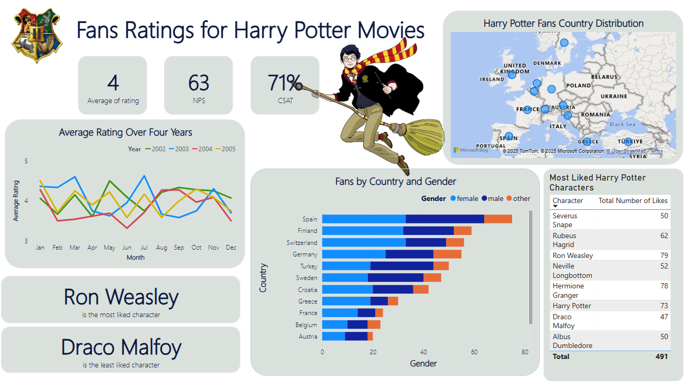

# 🧙‍♂️ Dashboard Overview – Harry Potter Movies Rating
This Power BI dashboard showcases insights gathered from Harry Potter movie fans across various countries. Here's a breakdown of each visual element and what it represents:

## 📊Dashbaord breakdown

### 🔢 KPI Cards
-**Average Rating**: The average rating of the movies is 4 out of 5, this indicates that fans had a positive experience with the movies  

-**NPS (Net Promoter Score)**: The NPS score of 60 suggests that a large majority of fans are loyal to the Harry Potter franchise and are therefore likely to recommend Harry Potter movies to friends or collegues (highly satisfied).

-**CSAT (Customer Satisfaction Score)**: A CSAT of 71% indicates that a strong majority of fans are satisfied with the Harry Potter movies, though there's room to improve sentiment among a quarter of the audience. 

## 📈 Harry Potter Rating Over a Year
The line chart shows average monthly rating trends over four years.

## 🌍 Harry Potter Fans Country Distribution
Map Visual with geo-bubbles indicating user presence in various European countries 

## 👩‍🦰 Harry Potter Fans by Country and Gender
Stacked Bar Chart segmented by gender (Female, Male, Other)
- This visual displays fan demographics and highlights gender-based preferences across different countries. For instance, Spain and Finland have the highest number of fans, with noticeable gender diversity.

## 🌟 Most Liked Harry Potter Characters
Table listing characters with the total number of "likes" received.
Top liked characters include:
- Ron Weasley (79 likes)
- Hermione Granger (78)
- Harry Potter (73)
- Rubeus Hagrid (62)

- Ron Weasley is highlighted as the most liked character.
- Draco Malfoy is the least liked character.

## 🎯 Insights & Takeaways
- Ron Weasley is the fan-favorite, followed closely by Hermione Granger and Harry Potter.
- There's a strong European fan base, especially in Spain, Finland, and Switzerland.
- Ratings fluctuate seasonally, with a notable increase mid-year (August).
- Gender diversity among fans is well-represented, with slight female predominance in most countries.

